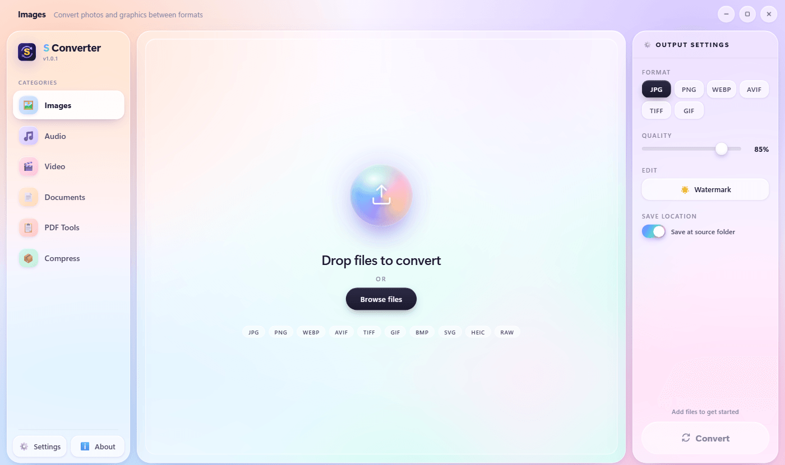
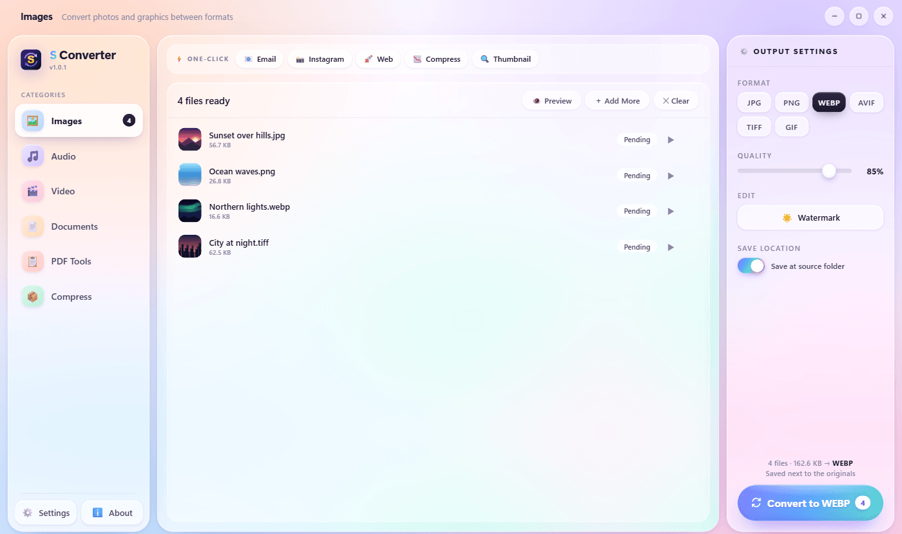
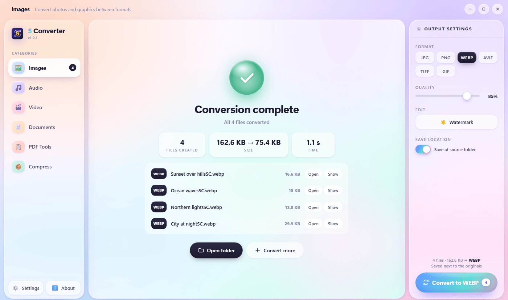
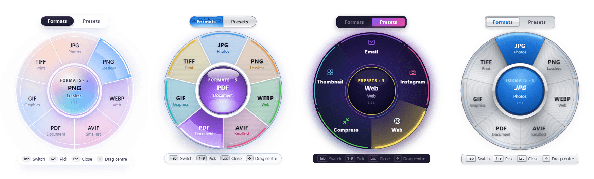
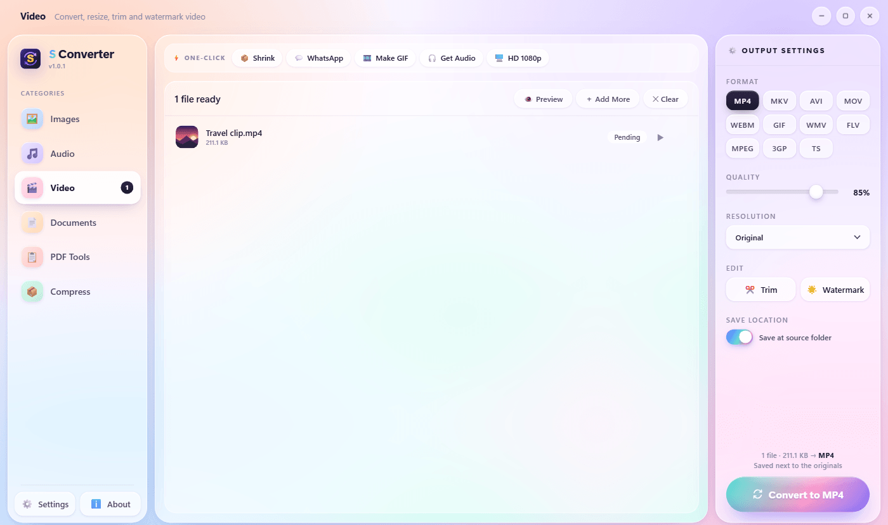
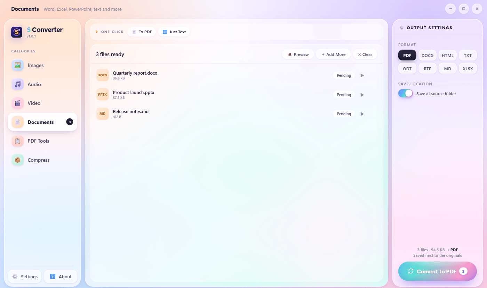
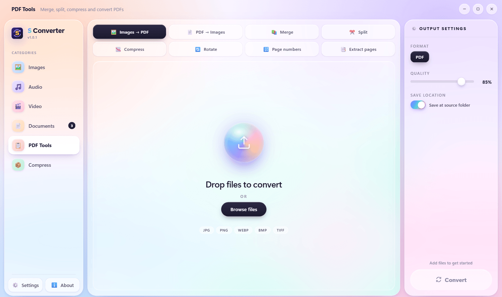
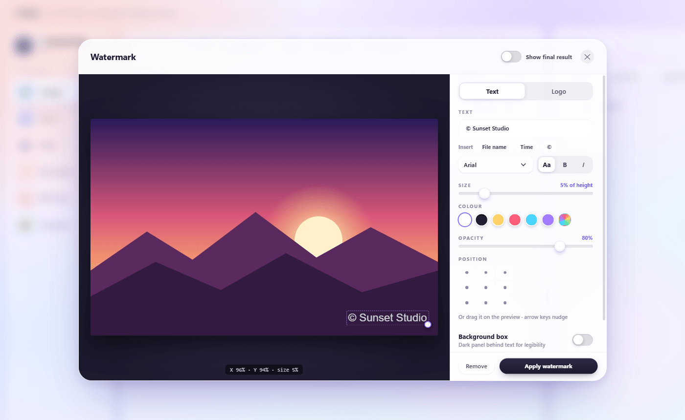
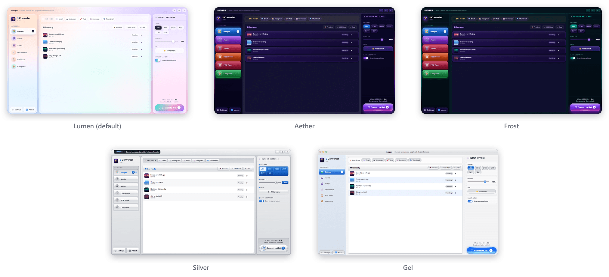

# S Converter

**The all-in-one file converter for Windows.** 
Images, video, audio, documents, PDFs and archives: fast, beautiful, and completely offline.

 

  

 

## Contents

- [Why S Converter](#why-s-converter)
- [Features](#features)
  - [Convert anything, in batches](#convert-anything-in-batches)
  - [Quick Convert, right from File Explorer](#quick-convert-right-from-file-explorer)
  - [Video, with your graphics card](#video-with-your-graphics-card)
  - [Documents, no Office needed](#documents-no-office-needed)
  - [PDF tools](#pdf-tools)
  - [Watermarks](#watermarks)
  - [Archives and passwords](#archives-and-passwords)
  - [Five themes](#five-themes)
- [Supported formats](#supported-formats)
- [Install](#install)
- [Updates](#updates)
- [Frequently asked questions](#frequently-asked-questions)
- [Requirements](#requirements)
- [Feedback](#feedback)

 

## Why S Converter

|  |  |
|---|---|
| 🔒 **Private** | Everything happens on your own PC. Nothing is uploaded, ever, and it works with no internet connection. |
| ⚡ **Fast** | Converts whole folders at once and uses your graphics card for video. |
| 🧰 **All in one** | Images, video, audio, documents, PDFs and archives in a single app, with no extra software to install. |
| 🎯 **Two clicks** | Select files in File Explorer, press a shortcut, pick a format. Done. |
| ✨ **Beautiful** | A modern interface with five themes, from soft glass to classic chrome. |
| 💸 **Free** | No ads, no watermark on your files, no account, no limits. |

 

## Features

### Convert anything, in batches

Drop in one file or hundreds. Pick the output format, adjust the quality if you like, and press **Convert**. One-click presets handle everyday jobs such as *Email*, *Instagram*, *Web* and *Thumbnail*.

When it's finished you see exactly what was made and how much space you saved, with one click to open each file or its folder.

### Quick Convert, right from File Explorer

Select files in File Explorer and press **Ctrl + Alt + C**, or right-click them and choose **S Converter → Quick Convert…**. A wheel opens right at your mouse: point at a format and click. The app doesn't even need to open.

- **Formats** and **Presets** pages, with presets like *Email*, *WhatsApp*, *Make GIF*, *Get Audio* and *Locked ZIP*
- Several photos to PDF asks whether you want one PDF or one per photo
- Keyboard friendly: numbers pick a slice, **Tab** switches pages, **Esc** closes
- Drag the wheel anywhere by its centre
- Works on folders too: pack them into ZIP, 7Z or RAR in one go

### Video, with your graphics card

Convert between MP4, MKV, MOV, WebM, AVI and more, make GIFs, pull out the audio, change the resolution, and **trim** clips with a visual timeline. S Converter detects NVIDIA, Intel and AMD graphics and uses them automatically for much faster encoding, falling back to the processor whenever needed.

### Documents, no Office needed

Word, PowerPoint, Excel, OpenDocument, RTF, Markdown, HTML, EPUB and plain text, converted by S Converter's own engine, with no Microsoft Office or LibreOffice required.

- Word and OpenDocument keep headings, bold and italic, lists, tables, pictures and links
- PowerPoint slides become a PDF that keeps their layout, pictures and colours
- Tables inside a document can become an Excel spreadsheet
- PDFs get A4 pages with page numbers

### PDF tools

Everything you usually need an online PDF site for, done privately on your PC:

| Tool | What it does |
|---|---|
| **Images → PDF** | One PDF from many pictures, or one PDF per picture |
| **PDF → Images** | Every page as a JPG |
| **Merge** | Join PDFs, in the order you choose |
| **Split** | Every page on its own, or by ranges like `1-3, 4-8, 9-` |
| **Compress** | Make PDFs smaller while keeping text sharp |
| **Rotate** | Turn every page |
| **Page numbers** | Add "Page 1 of 9" and similar |
| **Extract pages** | Keep only the pages you pick |

### Watermarks

Add your name or logo to photos and videos. Drag it where you want it on a live preview, then set size, colour and opacity, add a background box, repeat it in five places so it's harder to crop out, or let it scroll across a video. The same watermark is applied to every file in the batch.

### Archives and passwords

- **Pack folders** into ZIP, 7Z, RAR or TAR.GZ
- **Protect them with a password:** ZIP uses AES-256 encryption; 7Z (with 7-Zip) and RAR (with WinRAR) hide the file names as well
- **Extract** ZIP, 7Z, RAR, TAR, ISO and CAB files, including password-protected ones, without the pointless extra folder

### Five themes

Pick the look you like in **Settings → Theme**. The Quick Convert wheel changes with it.

 

## Supported formats

| Category | Converts from | Converts to |
|---|---|---|
| **Images** | JPG, PNG, WebP, AVIF, TIFF, GIF, BMP, SVG, HEIC/HEIF (iPhone), camera RAW (CR2, NEF, ARW, DNG, RAF, ORF, RW2) | JPG, PNG, WebP, AVIF, TIFF, GIF, PDF |
| **Video** | MP4, MKV, AVI, MOV, WMV, FLV, WebM, MPEG, M4V, 3GP, TS, VOB, MTS/M2TS, OGV | MP4, MKV, AVI, MOV, WebM, GIF, WMV, FLV, MPEG, 3GP, TS |
| **Audio** | MP3, WAV, FLAC, AAC, OGG, WMA, M4A, AIFF, Opus, AMR, AC3, and the sound from any video | MP3, WAV, FLAC, AAC, OGG, M4A, Opus, AIFF, WMA, AC3, AMR |
| **Documents** | DOCX, DOC, ODT, RTF, TXT, Markdown, HTML, EPUB, PPTX, PPT, ODP, XLSX, XLS, ODS, CSV | PDF, DOCX, ODT, RTF, HTML, TXT, Markdown, XLSX |
| **Archives** | ZIP, 7Z, RAR, TAR, TGZ, GZ, BZ2, XZ, ISO, CAB | Folder, ZIP, 7Z, RAR\*, TAR.GZ |

\* Creating RAR files needs WinRAR installed. Password-protected 7Z needs 7-Zip.

 

## Install

1. **Download** the installer: open the [latest release](https://github.com/SujithShalitha/s-converter-releases/releases/latest) and click **S-Converter-Setup-x.x.x.exe** under *Assets*.
2. **Run it.** Windows may show **"Windows protected your PC"**. Click **More info**, then **Run anyway**. This happens because the installer isn't code-signed yet; it doesn't mean anything is wrong with the file.
3. **Choose where to install.** No administrator rights are needed.
4. **Open S Converter** from the Start menu or the desktop shortcut, and drop in some files.

To turn on the right-click menu in File Explorer, open **Settings** and switch on **Explorer right-click menu**. On Windows 11 it appears under **Show more options**.

 

## Updates

S Converter keeps itself up to date automatically. It downloads new versions in the background and installs them on its own when you're not using it, never in the middle of a conversion, then carries on exactly where it was. There's nothing to click. You can see the current version, or check right away, in **Settings → Updates**.

See what changed in each version on the [Releases page](https://github.com/SujithShalitha/s-converter-releases/releases).

 

## Frequently asked questions

<b>Is it really free?</b>

 
Yes. No ads, no trial, no account, and no watermark added to your files.

<b>Are my files uploaded anywhere?</b>

 
No. Every conversion runs on your own computer, and S Converter works without an internet connection. The only thing it ever downloads is its own updates.

<b>Why does Windows say "Windows protected your PC"?</b>

 
Windows shows this for new programs that aren't code-signed with a paid certificate. Click <b>More info → Run anyway</b>. You only need to do it once.

<b>Where do the converted files go?</b>

 
By default, next to the originals, with "SC" added to the name so nothing is ever overwritten. You can choose a different folder in the output settings.

<b>The Quick Convert shortcut doesn't work.</b>

 
Another program may already be using Ctrl + Alt + C. Pick a different shortcut in <b>Settings → Quick Convert shortcut</b>. S Converter stays in the system tray so the shortcut keeps working after you close its window.

<b>How do I uninstall it?</b>

 
Windows Settings → Apps → Installed apps → S Converter → Uninstall. The Explorer menu entries are removed too.

 

## Requirements

- Windows 10 (version 1803 or newer) or Windows 11, 64-bit
- About 600 MB of free disk space
- Optional: an NVIDIA, Intel or AMD graphics card for faster video; WinRAR to create RAR files; 7-Zip for password-protected 7Z

 

## Feedback

Found a problem or have an idea? [Open an issue](https://github.com/SujithShalitha/s-converter-releases/issues) and include what you were converting, what happened, and your Windows version.

 

---

**S Converter** is developed by **Sujith Shalitha Dassanayake**. 
© 2026 Sujith Shalitha Dassanayake. All rights reserved. Free to download and use.

S Converter includes <a href="https://ffmpeg.org">FFmpeg</a> 6.1.1 (GPL; build by <a href="https://www.gyan.dev/ffmpeg/builds/">gyan.dev</a>; source code at <a href="https://ffmpeg.org/download.html#get-sources">ffmpeg.org</a>),
Electron, sharp and libvips, pdf.js, pdf-lib, mammoth, SheetJS, JSZip, and the Nunito and Orbitron fonts (SIL Open Font License), each under its own license.

