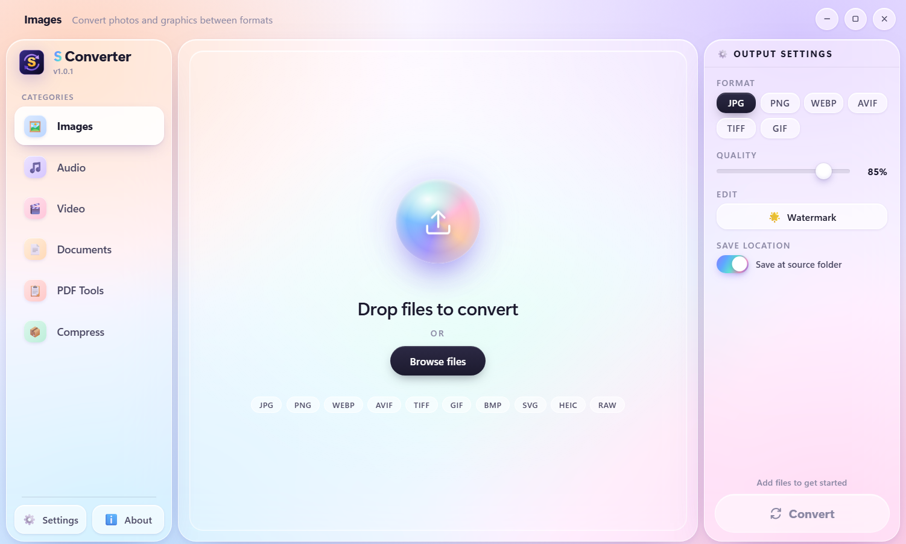
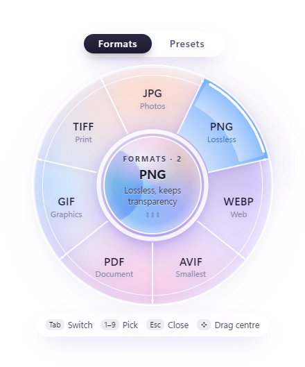

  

<h1 align="center">S Converter</h1>

  An all-in-one file converter for Windows: images, audio, video, documents and PDFs. 
  Everything runs on your own computer. Your files are never uploaded.

  <a href="https://github.com/SujithShalitha/s-converter-releases/releases/latest"><b>⬇ Download the latest version</b></a>

  

## What it does

- **Images:** JPG, PNG, WebP, AVIF, TIFF and GIF, from almost anything including HEIC phone photos, BMP, SVG and camera RAW files. Resize, compress, rotate, and add text or logo watermarks.
- **Video:** MP4, MKV, MOV, WebM, AVI, GIF and more. Trim clips, change resolution, and watermark. Uses your graphics card (NVIDIA, Intel or AMD) when it can, for much faster conversions.
- **Audio:** MP3, WAV, FLAC, AAC, OGG, M4A and more, or pull the sound out of a video.
- **Documents:** Word, PowerPoint, Excel, OpenDocument, RTF, Markdown, HTML, EPUB and text, to PDF, Word, ODT, RTF, HTML, text, Markdown or Excel. No Office or LibreOffice needed.
- **PDF tools:** images to PDF, PDF to images, merge, split, compress, rotate, add page numbers and extract pages.
- **Archives:** pack folders into ZIP, 7Z or RAR, including password-protected ones, and extract archives (with passwords too).
- **Batch conversion:** convert hundreds of files in one go.

  

### Quick Convert, right from File Explorer

Select files in File Explorer and press **Ctrl + Alt + C**, or right-click and choose **S Converter → Quick Convert…**. A wheel opens at your mouse: pick a format and it's done, without opening the app. One-click presets cover common jobs like *shrink for email*, *video for WhatsApp* or *one PDF from these photos*.

### Five themes

Lumen (soft light glass), Aether (deep purple), Frost (teal glass), Silver (a classic media-player look) and Gel (glossy, in the style of classic Mac OS X). The Quick Convert wheel follows your theme.

## Install

1. Open the [latest release](https://github.com/SujithShalitha/s-converter-releases/releases/latest) and download **S-Converter-Setup-x.x.x.exe** (under *Assets*).
2. Run it. If Windows shows **"Windows protected your PC"**, click **More info → Run anyway**. This appears because the installer isn't code-signed yet; it's expected and doesn't mean anything is wrong with the file.
3. Choose where to install (no administrator rights needed) and you're ready.

**Updates are automatic.** S Converter checks for new versions in the background and offers *Restart to update* when one is ready. You can also check any time in **Settings → Updates**.

### Requirements

- Windows 10 (version 1803 or newer) or Windows 11, 64-bit
- About 600 MB of free disk space

## Questions or problems?

Open an [issue](https://github.com/SujithShalitha/s-converter-releases/issues) and describe what happened, which file type you were converting, and your Windows version.

## About

S Converter is developed by **Sujith Shalitha Dassanayake**.
© 2026 Sujith Shalitha Dassanayake. All rights reserved. The application is free to download and use.

S Converter includes <a href="https://ffmpeg.org">FFmpeg</a> 6.1.1 (GPL; build by <a href="https://www.gyan.dev/ffmpeg/builds/">gyan.dev</a>; source code at <a href="https://ffmpeg.org/download.html#get-sources">ffmpeg.org</a>),
Electron, sharp and libvips, pdf.js, pdf-lib, mammoth, SheetJS, JSZip, and the Nunito and Orbitron fonts (SIL Open Font License), each under its own license.

